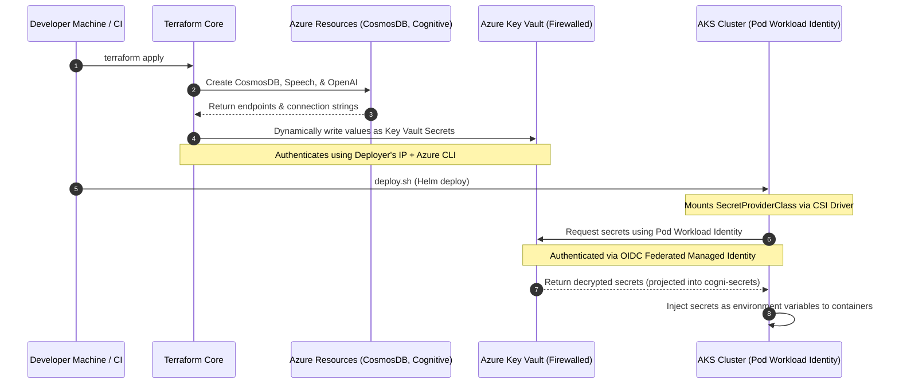

# cognidispatch-helm

GitOps Helm chart repository for **CogniDispatch** — managed by ArgoCD.

## Branch Strategy

| Branch | Environment | Tracked By |
|---|---|---|
| `production` | Production | ArgoCD prod apps |
| `dev` | Development | ArgoCD dev apps |

## Structure

```
cognidispatch-helm/
├── Chart.yaml              # Helm chart metadata
├── values.yaml             # Base/default values
├── values-dev.yaml         # Dev environment overrides
├── values-prod.yaml        # Production environment overrides
├── templates/              # Kubernetes manifests
├── microservices/          # Per-service image tag files (auto-updated by CI)
│   ├── auth-service/
│   │   ├── values-dev.yaml    ← updated when dev branch pipeline runs
│   │   └── values-prod.yaml   ← updated when production branch pipeline runs
│   ├── vendor-service/
│   ├── ai-service/
│   ├── admin-service/
│   ├── dispatch-service/
│   ├── payment-service/
│   └── frontend/
├── argocd-apps/            # ArgoCD Application CRDs (dev)
└── argocd-apps-prod/       # ArgoCD Application CRDs (production)
```

## How it works

1. Developer pushes to `dev` or `production` branch of a service repo
2. CI pipeline builds the Docker image and pushes to ACR
3. CI pipeline calls `_update_helm.yml` reusable workflow
4. The workflow updates `microservices/<service>/values-<env>.yaml` in this repo
5. ArgoCD detects the change and syncs the deployment

---

## Secure Secret Management Architecture

We have established a fully automated, zero-trust secrets architecture. No credentials, tokens, or connection strings are ever stored in the Git codebase.

### Secrets Architecture Workflow



---

### How it Works (Under the Hood)

#### 1. Dynamic Secret Provisioning (Terraform)
* **Resource Keys**: Secrets generated by Azure (such as the Cosmos DB connection string, Speech API keys, and OpenAI keys) are retrieved directly from resource state attributes during `terraform apply`.
* **Application Keys**: Secrets independent of Azure resources (such as `JWT-SECRET`) are dynamically generated using the `random_password` resource.
* **Firewall Whitelisting**: The machine executing the apply queries its public IP dynamically using the `http` provider. This IP is temporarily whitelisted in the Key Vault's `network_acls` during deployment, allowing the Terraform provider to write secrets to Key Vault without opening public access.

#### 2. Least-Privilege Identity Access (Entra ID & Workload Identity)
* **Pod Identity**: A User-Assigned Managed Identity `cogni-pod-identity` is created and granted read-only (`Get`, `List`) permissions on the Key Vault secrets plane.
* **Federated Credentials**: The identity is federated via OIDC with the Kubernetes service accounts across both namespaces:
  * `system:serviceaccount:cogni-dev:<service-account-name>`
  * `system:serviceaccount:cogni-dispatch:<service-account-name>`
* **Authentication**: When a pod starts, the Secrets Store CSI Driver requests a token from AKS. Entra ID validates the OIDC issuer URL and token, exchanging it for a Key Vault access token.

#### 3. Kubernetes Ingestion (Secrets Store CSI Driver)
* **SecretProviderClass**: Configured to sync the Key Vault secrets into a native Kubernetes Secret named `cogni-secrets`.
* **Overriding Placeholders**: Any service values in `values-dev.yaml` or `values-prod.yaml` are populated with safe dummy placeholders. At pod startup, the CSI driver creates the `cogni-secrets` secret. Because `envFrom` loads `cogni-secrets` last, these decrypted values override the placeholders in the container environment variables.

---

### How to View & Inspect Stored Values

As the administrator who logged into the Azure CLI, you are granted full permissions to inspect the secrets. You can view the stored values at any time via the Azure Portal or using the following CLI commands:

```bash
# View Cosmos DB connection string
az keyvault secret show --name "MONGODB-URI" --vault-name "cognidispatch-kv" --query "value" -o tsv

# View JWT Token Secret
az keyvault secret show --name "JWT-SECRET" --vault-name "cognidispatch-kv" --query "value" -o tsv

# View OpenAI Service Key
az keyvault secret show --name "AZURE-OPENAI-KEY" --vault-name "cognidispatch-kv" --query "value" -o tsv

# View Speech Service Key
az keyvault secret show --name "AZURE-SPEECH-KEY" --vault-name "cognidispatch-kv" --query "value" -o tsv
```

